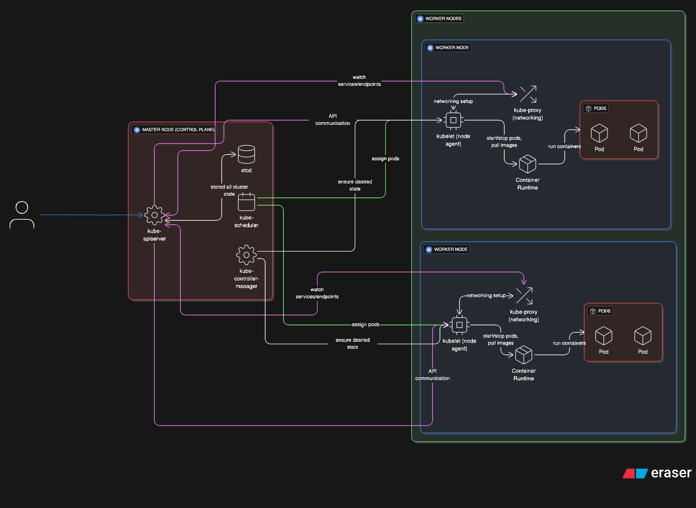

# 📘 Kubernetes Components: Master Node & Worker Node

## 📖 Overview

Kubernetes is a powerful container orchestration platform. It follows a **master-worker architecture** where the **Control Plane (Master Node)** manages the cluster, and **Worker Nodes** run your applications (Pods).

This document explains all key components of both **Master** and **Worker nodes** in a **declarative** and **easy-to-understand** manner.

---

## 🧠 Master Node (Control Plane)

The **Master Node** is responsible for **managing the cluster state**. It makes decisions about **scheduling, scaling, and responding to cluster events**.

### 🔹 1. API Server (`kube-apiserver`)
- Acts as the **front-end** for the Kubernetes control plane.
- All commands (`kubectl`, REST calls) go through the API server.
- Validates and processes requests.

### 🔹 2. etcd
- A **key-value store** used to store **all cluster data**.
- Stores configuration, state, and metadata.
- Highly available and consistent.

### 🔹 3. Scheduler (`kube-scheduler`)
- Watches for **unscheduled pods**.
- Decides **which node** a pod should run on.
- Considers CPU, memory, taints, affinities, etc.

### 🔹 4. Controller Manager (`kube-controller-manager`)
- Runs **various controllers** (loops) that monitor and manage cluster state.
- Examples:
  - **Node Controller**: watches node health.
  - **Replication Controller**: ensures desired number of pod replicas.
  - **Endpoint Controller**: manages service endpoints.

---

## 🧱 Worker Node (Cluster Node)

**Worker Nodes** are where your applications (Pods) actually run.

### 🔹 1. Kubelet
- An **agent** that runs on every worker node.
- Communicates with the API server.
- Ensures the containers described in PodSpecs are running.

### 🔹 2. Kube-Proxy
- Handles **networking**.
- Forwards traffic to the correct pod (load-balancing).
- Manages iptables or IPVS rules for Services.

### 🔹 3. Container Runtime
- Runs and manages containers.
- Examples:
  - **containerd** (default)
  - **Docker** (legacy support)
  - **CRI-O**
- Pulls images and runs containers.

---

## 🧩 Kubernetes Components Diagram

---

## 📝 Summary Table

| Layer         | Component                 | Role                                                                 |
|---------------|---------------------------|----------------------------------------------------------------------|
| Master Node   | `kube-apiserver`           | Exposes Kubernetes API, gateway to cluster                           |
| Master Node   | `etcd`                     | Stores all cluster configuration/state                               |
| Master Node   | `kube-scheduler`           | Assigns pods to worker nodes                                         |
| Master Node   | `kube-controller-manager`  | Ensures desired state (replicas, endpoints, etc.)                    |
| Worker Node   | `kubelet`                  | Runs on each node, ensures containers are running                    |
| Worker Node   | `kube-proxy`               | Manages network rules & service routing                              |
| Worker Node   | Container Runtime          | Executes containers (Docker, containerd, CRI-O, etc.)                |

---

## 🧭 Key Notes
- You can have **multiple master nodes** for high availability.
- `kubectl` communicates with the cluster via the API server.
- All cluster state is stored in `etcd`. Backup it regularly.
- Worker nodes **don’t make decisions**; they just run workloads.

---

## ✅ Tips for Beginners
- Start small: 1 master + 1 worker.
- Use `minikube` or `kind` to practice locally.
- Visualize using `kubectl get pods -A`, `kubectl describe node`, etc.
- Remember: Master = Brain 🧠, Worker = Muscle 💪
