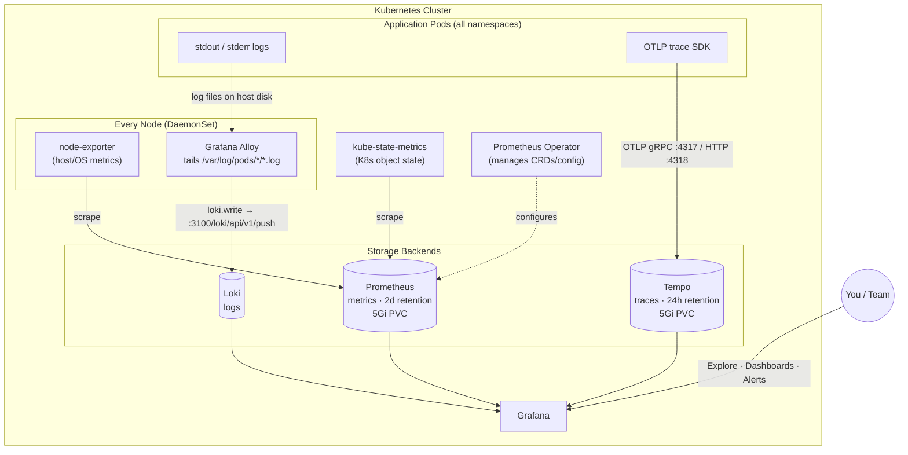

# Kubernetes Observability Stack

Metrics, logs, and traces for the cluster, built entirely on the Grafana + Prometheus
open-source stack:

| Signal  | Backend          | Collector / Source                          |
|---------|------------------|----------------------------------------------|
| Metrics | Prometheus       | kube-prometheus-stack (node-exporter, kube-state-metrics, ServiceMonitors) |
| Logs    | Loki             | Grafana Alloy (DaemonSet, tails `/var/log/pods`) |
| Traces  | Tempo            | Application SDKs pushing OTLP directly to Tempo |
| Visualization | Grafana    | Single pane of glass for all three          |

> **Note on log shipping:** this stack originally used Promtail. Promtail reached
> end-of-life on March 2, 2026 (LTS support ended, no further security/bug fixes),
> so log collection was migrated to **Grafana Alloy**, Promtail's official
> successor. See [`alloy/alloy-values.yaml`](./alloy/alloy-values.yaml) and
> [`docs/promtail-to-alloy-migration.md`](./docs/promtail-to-alloy-migration.md).

---

## Architecture & data flow



**In words:**

1. Every application pod writes logs to stdout/stderr, which Kubernetes persists as
   files under `/var/log/pods/<namespace>_<pod>_<uid>/<container>/*.log` on the node
   it's running on.
2. **Alloy** runs as a DaemonSet (one pod per node), discovers those pods via the
   Kubernetes API, tails their log files locally, parses the CRI log format, and
   pushes the parsed entries to **Loki** over HTTP.
3. **node-exporter** (host metrics) and **kube-state-metrics** (Kubernetes object
   state) expose Prometheus-format metrics; the **Prometheus Operator** wires up
   scrape configs via `ServiceMonitor`/`PodMonitor` CRDs, and **Prometheus** scrapes
   and stores the resulting time series.
4. Instrumented applications push traces directly to **Tempo** via OTLP
   (gRPC on `4317` or HTTP on `4318`) — no separate trace collector needed for a
   single-cluster setup like this.
5. **Grafana** is configured with Prometheus, Loki, and Tempo as datasources, so you
   can correlate a trace → the logs from that pod → the resource metrics from that
   node, all in one place.

---

## Repository layout

```
k8s-observability-stack/
├── README.md                          # this file
├── prometheus/
│   └── prometheus-values.yaml         # kube-prometheus-stack Helm values
├── loki/
│   └── loki-values.yaml               # loki-stack Helm values (promtail disabled)
├── alloy/
│   └── alloy-values.yaml              # Alloy Helm values — replaces promtail
├── tempo/
│   └── tempo-values.yaml              # Tempo Helm values
└── docs/
    ├── architecture.md                # (optional) longer-form architecture notes
    └── promtail-to-alloy-migration.md # why/how promtail was replaced
```

---

## Prerequisites

- A running Kubernetes cluster and `kubectl` context pointed at it
- [Helm 3](https://helm.sh/docs/intro/install/) installed locally
- A `monitoring` namespace (created below)
- A default `StorageClass` available for PVCs (this stack assumes `local-path`;
  swap for `nfs-csi`, `gp2`, etc. as needed — see each `values.yaml`)

```bash
kubectl create namespace monitoring
```

---

## Installation

Install order matters a little: bring up the **storage backends** first
(Prometheus, Loki, Tempo), then the **collectors** that feed them (Alloy is
the only extra collector needed here — Prometheus scrapes itself via the
Operator, and traces are pushed directly by instrumented apps).

### 1. Add the required Helm repositories

```bash
helm repo add prometheus-community https://prometheus-community.github.io/helm-charts
helm repo add grafana https://grafana.github.io/helm-charts
helm repo update
```

### 2. Install Prometheus (kube-prometheus-stack)

Deploys Prometheus, the Prometheus Operator, Alertmanager, node-exporter, and
kube-state-metrics.

```bash
helm install kind-prometheus prometheus-community/kube-prometheus-stack \
  -n monitoring \
  -f prometheus/prometheus-values.yaml
```

Verify:
```bash
kubectl get pods -n monitoring -l "release=kind-prometheus"
```

### 3. Install Loki

```bash
helm install loki grafana/loki-stack \
  -n monitoring \
  -f loki/loki-values.yaml
```

Verify:
```bash
kubectl get pods -n monitoring -l "app=loki"
```

### 4. Install Grafana Alloy (log collector)

```bash
helm install alloy grafana/alloy \
  -n monitoring \
  -f alloy/alloy-values.yaml
```

Verify Alloy is tailing files and pushing to Loki without errors:
```bash
kubectl get pods -n monitoring -l app.kubernetes.io/name=alloy
kubectl logs -n monitoring -l app.kubernetes.io/name=alloy --tail=50
```
> On first startup you may briefly see `400 Bad Request ... timestamp too old`
> errors — this is Alloy discarding old log backlog that falls outside Loki's
> retention window, not a real failure. It clears up within a couple of minutes.
> See `docs/promtail-to-alloy-migration.md` for details.

### 5. Install Tempo

```bash
helm install tempo grafana/tempo \
  -n monitoring \
  -f tempo/tempo-values.yaml
```

Verify:
```bash
kubectl get pods -n monitoring -l "app.kubernetes.io/name=tempo"
```

### 6. Confirm everything is running

```bash
kubectl get pods -n monitoring
```

You should see, roughly:
```
alertmanager-kind-prometheus-kube-prome-alertmanager-0   Running
kind-prometheus-grafana-...                               Running
kind-prometheus-kube-prome-operator-...                    Running
kind-prometheus-kube-state-metrics-...                     Running
kind-prometheus-prometheus-node-exporter-...    (one per node) Running
loki-0                                                      Running
alloy-...                                        (one per node) Running
prometheus-kind-prometheus-kube-prome-prometheus-0          Running
tempo-0                                                      Running
```

---

## Connecting things in Grafana

If Grafana wasn't installed with auto-provisioned datasources, add them manually
under **Connections → Data sources**:

| Datasource | URL |
|---|---|
| Prometheus | `http://kind-prometheus-kube-prome-prometheus:9090` |
| Loki | `http://loki:3100` |
| Tempo | `http://tempo:3100` |

(Adjust service names to match `kubectl get svc -n monitoring` in your cluster.)

To send traces from an application, point its OTLP exporter at:
```
grpc://tempo.monitoring.svc.cluster.local:4317
```
or
```
http://tempo.monitoring.svc.cluster.local:4318
```

---

## Configuration notes / things to be aware of

- **Retention:**
  - Prometheus: `2d` (`prometheus/prometheus-values.yaml`) — short, tune for
    your alerting/dashboard needs.
  - Tempo: `24h` (`tempo/tempo-values.yaml`).
  - **Loki: no explicit retention is set** in `loki/loki-values.yaml`. Left
    as-is, Loki will keep logs indefinitely, bounded only by available disk.
    If you want a fixed retention window, add a `compactor` + `limits_config`
    block (see [Loki retention docs](https://grafana.com/docs/loki/latest/operations/storage/retention/)).
- **Storage:** all three backends use the `local-path` StorageClass with 5Gi
  PVCs — fine for a small/dev cluster, but `local-path` ties data to a specific
  node's disk. For production, prefer a networked StorageClass (`nfs-csi`,
  `gp2`, etc.) so pods can reschedule without losing data.
- **Disabled shippers:** `loki-values.yaml` also ships config for `fluent-bit`,
  `filebeat`, and `logstash` as alternative log shippers — none of these are
  enabled; Alloy is the only active collector.

---

## Uninstalling

```bash
helm uninstall tempo -n monitoring
helm uninstall alloy -n monitoring
helm uninstall loki -n monitoring
helm uninstall kind-prometheus -n monitoring
kubectl delete namespace monitoring   # only if nothing else lives there
```
