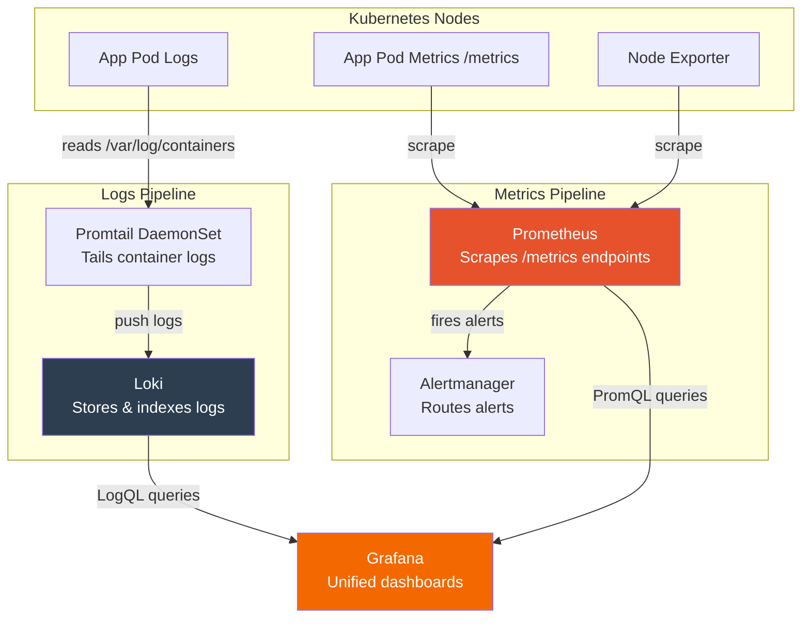

# 📊 K8s Monitoring Stack — Prometheus • Grafana • Loki

A production-ready, Helm-based observability stack for Kubernetes: **metrics** via
Prometheus + Grafana, and **logs** via Loki + Promtail — all installed with two
Helm commands.

---

## 📁 Project Structure

```
prometheus-loki-monitoring/
├── README.md                     # You are here
├── prometheus-values.yaml      # Prometheus retention & storage overrides
├── loki-values.yaml                # Loki + Promtail overrides (logs pipeline) 
├── install.sh                         # One-shot installer (automates all steps)
└── architecture.md               # Diagrams & data-flow notes
```

---

## 🧰 Prerequisites

| Tool | Purpose | Check |
|---|---|---|
| Kubernetes cluster | Target platform (kind/k3s/EKS/etc.) | `kubectl version` |
| `kubectl` | Cluster access | `kubectl cluster-info` |
| `helm` v3+ | Chart installer | `helm version` |
| StorageClass | Persistent volumes for Prometheus | `kubectl get sc` |

---

## 🚀 Quick Start

### Option A — Automated (recommended)

```bash
git clone <your-repo-url> k8s-monitoring-stack
cd k8s-monitoring-stack
chmod +x install.sh
./install.sh
```

### Option B — Manual, step by step

#### Step 1 — Create the monitoring namespace
```bash
kubectl create ns monitoring
```

#### Step 2 — Add required Helm repositories
```bash
helm repo add prometheus-community https://prometheus-community.github.io/helm-charts
helm repo add stable https://charts.helm.sh/stable
helm repo add grafana https://grafana.github.io/helm-charts
helm repo update
```

#### Step 3 — Install Prometheus + Grafana + Alertmanager
```bash
helm install kind-prometheus prometheus-community/kube-prometheus-stack \
  --namespace monitoring \
  --set prometheus.service.nodePort=31111 \
  --set prometheus.service.type=NodePort \
  --set grafana.service.nodePort=31112 \
  --set grafana.service.type=NodePort \
  --set alertmanager.service.nodePort=31113 \
  --set alertmanager.service.type=NodePort \
  --set prometheus-node-exporter.service.nodePort=31114 \
  --set prometheus-node-exporter.service.type=NodePort \
  -f prometheus/prometheus-values.yaml
```

#### Step 4 — Install Loki + Promtail (log pipeline)
```bash
helm search repo loki                              # optional: verify chart exists
helm show values grafana/loki-stack > loki-values.yaml   # optional: regenerate defaults

helm upgrade --install loki -f loki/loki-values.yaml \
  -n monitoring --create-namespace grafana/loki-stack
```

#### Step 5 — Verify everything is running
```bash
kubectl get pods -n monitoring
kubectl get svc  -n monitoring
```
All pods should reach `Running`/`Ready` status within a couple of minutes.

---

## 🔑 Accessing the Dashboards

| Service | NodePort | Default Credentials |
|---|---|---|
| Prometheus | `31111` | — |
| Grafana | `31112` | user: `admin` / pass: `kubectl get secret --namespace monitoring kind-prometheus-grafana -o jsonpath="{.data.admin-password}" \| base64 -d` |
| Alertmanager | `31113` | — |
| Node Exporter | `31114` | — |

Access via `http://<NODE_IP>:<NODE_PORT>` in your browser.

> ⚠️ Grafana's Loki datasource is **disabled by default** in `loki-values.yaml`
> (`grafana.enabled: false`) since Grafana is already provided by the
> `kube-prometheus-stack` release. Add Loki as a datasource manually in
> Grafana → *Connections → Data sources* → URL: `http://loki:3100`.

---

## 🔄 Working Flow (How it all fits together)



**In plain words:**
1. **Promtail** (runs on every node as a DaemonSet) tails container log files and
   ships them to **Loki**, which stores and indexes them.
2. **Prometheus** scrapes `/metrics` endpoints from your workloads and from
   **Node Exporter** (host-level CPU/RAM/disk metrics).
3. Prometheus evaluates alert rules and forwards firing alerts to
   **Alertmanager** for routing/notification.
4. **Grafana** sits on top of both Loki (logs, via LogQL) and Prometheus
   (metrics, via PromQL), giving you a single pane of glass to explore and
   correlate logs with metrics.

---

## ⚙️ Configuration Notes

- **`prometheus/prometheus-values.yaml`**
  - `retention: 2d` — Prometheus keeps only 2 days of TSDB data. Increase for
    longer historical dashboards.
  - `storageClassName: local-path` — swap for your cluster's actual
    StorageClass (e.g. `gp2` on EKS, `nfs-csi`, etc.).

- **`loki/loki-values.yaml`**
  - `loki.image.tag: 2.9.10` — pinned Loki version.
  - `promtail.enabled: true` — ships logs to Loki automatically.
  - `fluent-bit`, `filebeat`, `logstash`, `grafana` are all **disabled** —
    this setup uses the lightweight Promtail path only.

---

## 🧹 Uninstall / Cleanup

```bash
helm uninstall kind-prometheus -n monitoring
helm uninstall loki -n monitoring
kubectl delete ns monitoring
```

---

## 🛠️ Troubleshooting

| Symptom | Likely Cause | Fix |
|---|---|---|
| Pods stuck `Pending` | No PVC bound | Check `kubectl get pvc -n monitoring` and StorageClass |
| Grafana shows no logs | Loki datasource not added | Manually add `http://loki:3100` in Grafana UI |
| NodePort not reachable | Firewall / cloud security group | Open the relevant NodePort range (30000–32767) |
| Promtail `CrashLoopBackOff` | Wrong `clients.url` in values file | Confirm it matches the Loki service name (`{{ .Release.Name }}:3100`) |

---

## 📄 License

Internal infrastructure documentation — adapt freely for your environment.